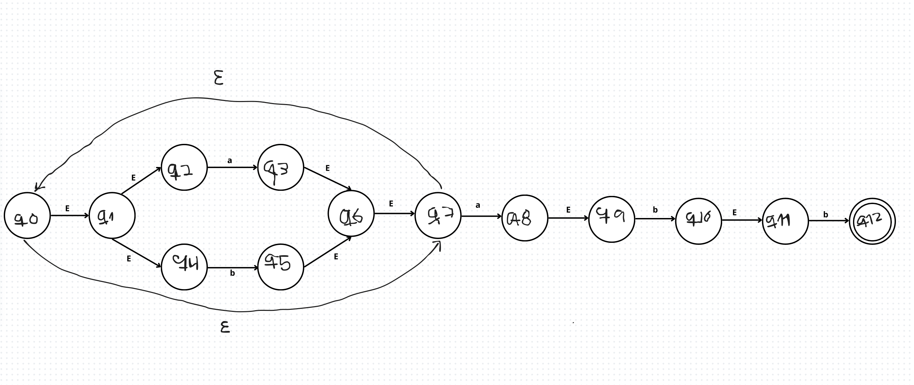
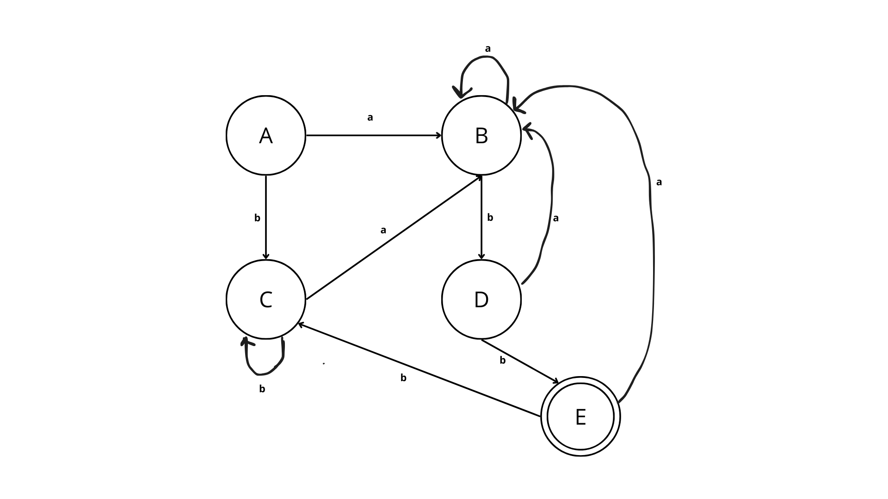

# Regex -> NFA -> DFA Converter
### Cesar Augusto Ramirez Davila A01712439
## Descripcion del proyecto


Este proyecto implementa un programa en Python que convierte una expresion regular en un automata finito deterministico (DFA). Para lograr esto se sigue el proceso visto en clase:

RegEx -> NFA -> DFA

Primero se construye un automata finito no deterministico (NFA) usando el algoritmo de Thompson. Posteriormente este NFA se convierte a un automata finito deterministico (DFA) utilizando el algoritmo de construccion por subconjuntos.

El programa permite ingresar el alfabeto y la expresion regular, genera el NFA correspondiente y despues calcula el DFA equivalente.

---

# Estructura del proceso

El programa sigue tres pasos principales:

1. Convertir la expresion regular de notacion infija a postfix.
2. Construir el NFA utilizando el algoritmo de Thompson.
3. Convertir el NFA a DFA mediante el algoritmo de subconjuntos.

---

# Entrada del programa

El programa recibe dos entradas:

Alphabet  
RegEx

Ejemplo:

Alphabet: ab

RegEx: (a|b)*.a.b.b

Nota: la concatenacion debe escribirse explicitamente usando el operador `.`

---

# Ejemplo de ejecucion

Entrada:

Alphabet: ab

RegEx: (a|b)*.a.b.b

Salida esperada:

Se genera primero el NFA y despues el DFA equivalente.

---

# Construccion del automata paso a paso

Antes de programar el algoritmo se resolvio el automata manualmente para entender el proceso y que me fuera mas sencillo entencer como hacerlo.

## Automata NFA

Primero se construyo el NFA usando las reglas del algoritmo de Thompson.

Espacio para imagen del NFA construido a mano:



---

## Conversion NFA -> DFA

Posteriormente se aplico el algoritmo de subconjuntos para convertir el NFA en un DFA, obteniendo la tablade cambio de estados 

| Estado    | a         | b         | 
|-----------|-----------|-----------|
|    A      |    B      |   C       |
|    B      |    B      |   D       |
|    C      |    B      |   C       |
|    D      |    B      |   E       |
|    E      |    B      |   C       |

Este proceso consiste en:

- calcular epsilon cerradura
- aplicar la funcion move
- generar nuevos estados del DFA a partir de subconjuntos de estados del NFA


---

## DFA Final

Despues de aplicar el algoritmo se obtiene el DFA final equivalente.




---

# Algoritmos implementados

El programa implementa dos algoritmos principales:

### Thompson Construction

Este algoritmo permite construir un NFA a partir de una expresion regular. Cada operador de la expresion genera una estructura especifica de estados y transiciones.

Operadores utilizados:

- Union `|`
- Concatenacion `.`
- Cerradura de Kleene `*`

---

### Subset Construction

Este algoritmo convierte un NFA con transiciones epsilon en un DFA. Para esto se utilizan dos funciones principales:

- epsilon closure
- move

Cada estado del DFA representa un conjunto de estados del NFA.

---

# Estructura del codigo

El programa esta organizado en varias partes:

- Conversion de regex a postfix
- Construccion del NFA
- Conversion de NFA a DFA
- Impresion de resultados

Cada funcion esta documentada con comentarios para explicar su funcionamiento.

---

# Como ejecutar el programa

1. Abrir una terminal
2. Ejecutar el archivo Python

```bash
python regex_to_dfa.py
